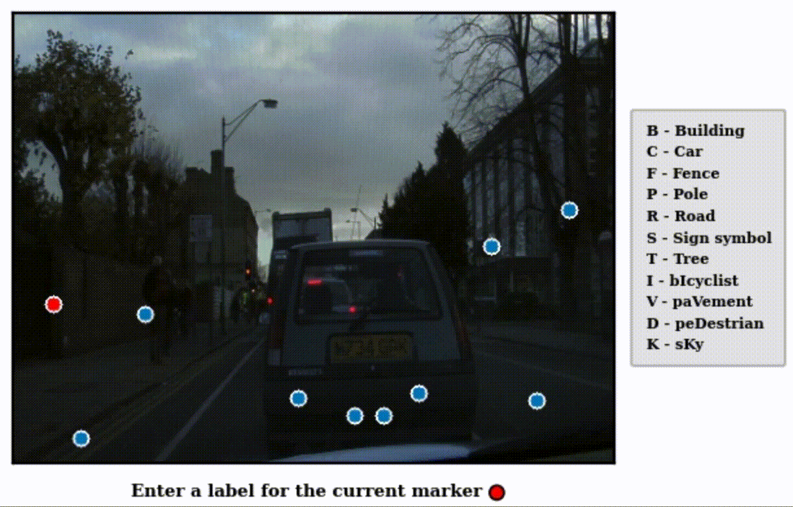

# PixelPick
This is an official implementation of the paper "All you need are a few pixels: semantic segmentation with PixelPick."

<p align="center">
  </img>
</p>

[[Project page]](https://www.robots.ox.ac.uk/~vgg/research/pixelpick/ "project_page")
[[Paper]](https://arxiv.org/abs/2104.06394 "Paper")


### Table of contents
* [Abstract](#abstract)
* [Installation](#installation)
* [Benchmark results](#benchmark-results)
* [Models](#models)
* [PixelPick mouse-free annotation tool](#pixelpick-mouse-free-annotation-tool) (to be updated)
* [Citation](#citation) (to be updated)
* [Acknowledgements](#acknowledgements)

### Abstract
A central challenge for the task of semantic segmentation is the prohibitive cost of obtaining dense pixel-level annotations to supervise model training. In this work, we show that in order to achieve a good level of segmentation performance, all you need are a few well-chosen pixel labels. We make the following contributions: (i) We investigate the novel semantic segmentation setting in which labels are supplied only at sparse pixel locations, and show that deep neural networks can use a handful of such labels to good effect; (ii) We demonstrate how to exploit this phenomena within an active learning framework, termed PixelPick, to radically reduce labelling cost, and propose an efficient “mouse-free” annotation strategy to implement our approach; (iii) We conduct extensive experiments to study the influence of annotation diversity under a fixed budget, model pretraining, model capacity and the sampling mechanism for picking pixels in this low annotation regime; (iv) We provide comparisons to the existing state of the art in semantic segmentation with active learning, and demonstrate comparable performance with up to two orders of magnitude fewer pixel annotations on the CamVid, Cityscapes and PASCAL VOC 2012 benchmarks; (v) Finally, we evaluate the efficiency of our annotation pipeline and its sensitivity to annotator error to demonstrate its practicality. Our code, models and annotation tool will be made publicly available.

### Installation
##### Prerequisites
Our code is based on `Python 3.8` and uses the following Python packages.
```
torch>=1.8.1
torchvision>=0.9.1
tqdm>=4.59.0
cv2>=4.5.1.48
```


##### Clone this repository
```shell
git clone https://github.com/NoelShin/PixelPick.git
cd PixelPick
```

##### Download dataset
Follow one of the instructions below to download a dataset you are interest in. Then, __set the `dir_dataset` variable in `args.py` to the directory path which contains the downloaded dataset__.

* For __CamVid__, you need to download SegNet-Tutorial codebase as a zip file and use `CamVid` directory which contains images/annotations for training and test after unzipping it. You don't need to change the directory structure. [[CamVid]](https://github.com/alexgkendall/SegNet-Tutorial "camvid")

* For __Cityscapes__, first visit the link and login to download. Once downloaded, you need to unzip it. You don't need to change the directory structure. It is worth noting that, if you set `downsample` variable in `args.py` (4 by default), it will first downsample train and val images of Cityscapes and store them within `{dir_dataset}_d{downsample}` folder which will be located in the same directory of `dir_dataset`. This is to enable a faster dataloading during training. [[Cityscapes]](https://www.cityscapes-dataset.com "cityscapes")

* For __PASCAL VOC 2012__, the dataset will be automatically downloaded via `torchvision.datasets.VOCSegmentation`. You just need to specify which directory you want to download it with `dir_dataset` variable. If the automatic download fails, you can manually download through the following page (you don't need to untar `VOCtrainval_11-May-2012.tar` file which will be downloaded). [[PASCAL VOC 2012 segmentation]](http://host.robots.ox.ac.uk/pascal/VOC/voc2012/#devkit)

__For more details about the data we used to train/validate our model, please visit `datasets` directory and find `{camvid, cityscapes, voc}_{train, val}.txt` file.__

##### Train and validate
By default, the current code validates the model every epoch while training. To train a MobileNetv2-based DeepLabv3+ network, follow the below lines. (The pretrained MobileNetv2 will be loaded automatically.)
```shell
cd scripts
sh pixelpick-dl-cv.sh
```
### Benchmark results
For CamVid and Cityscapes, we report the average of 5 different runs and 3 different runs for PASCAL VOC 2012. Please refer to our paper for details. ± one std of mean IoU is denoted.
##### CamVid
model|backbone (encoder)| # labelled pixels per img (% annotation) | mean IoU (%)
:---|:---|:---:|:---:
PixelPick|MobileNetv2|20 (0.012)|50.8 ± 0.2
PixelPick|MobileNetv2|40 (0.023)|53.9 ± 0.7
PixelPick|MobileNetv2|60 (0.035)|55.3 ± 0.5
PixelPick|MobileNetv2|80 (0.046)|55.2 ± 0.7
PixelPick|MobileNetv2|100 (0.058)|55.9 ± 0.1
Fully-supervised|MobileNetv2|360x480 (100)|58.2 ± 0.6
PixelPick|ResNet50|20 (0.012)|59.7 ± 0.9
PixelPick|ResNet50|40 (0.023)|62.3 ± 0.5
PixelPick|ResNet50|60 (0.035)|64.0 ± 0.3
PixelPick|ResNet50|80 (0.046)|64.4 ± 0.6
PixelPick|ResNet50|100 (0.058)|65.1 ± 0.3
Fully-supervised|ResNet50|360x480 (100)|67.8 ± 0.3

##### Cityscapes
Note that to make training time manageable, we train on the quarter resolution (256x512) of the original Cityscapes images (1024x2048).

model|backbone (encoder)| # labelled pixels per img (% annotation) | mean IoU (%)
:---|:---|:---:|:---:
PixelPick|MobileNetv2|20 (0.015)|52.0 ± 0.6
PixelPick|MobileNetv2|40 (0.031)|54.7 ± 0.4
PixelPick|MobileNetv2|60 (0.046)|55.5 ± 0.6
PixelPick|MobileNetv2|80 (0.061)|56.1 ± 0.3
PixelPick|MobileNetv2|100 (0.076)|56.5 ± 0.3
Fully-supervised|MobileNetv2|256x512 (100)| 61.4 ± 0.5
PixelPick|ResNet50|20 (0.015)|56.1 ± 0.4
PixelPick|ResNet50|40 (0.031)|60.0 ± 0.3
PixelPick|ResNet50|60 (0.046)|61.6 ± 0.4
PixelPick|ResNet50|80 (0.061)|62.3 ± 0.4
PixelPick|ResNet50|100 (0.076)|62.8 ± 0.4
Fully-supervised|ResNet50|256x512 (100)|68.5 ± 0.3

##### PASCAL VOC 2012
model|backbone (encoder)| # labelled pixels per img (% annotation) | mean IoU (%)
:---|:---|:---:|:---:
PixelPick|MobileNetv2|10 (0.009)|51.7 ± 0.2
PixelPick|MobileNetv2|20 (0.017)|53.9 ± 0.8
PixelPick|MobileNetv2|30 (0.026)|56.7 ± 0.3
PixelPick|MobileNetv2|40 (0.034)|56.9 ± 0.7
PixelPick|MobileNetv2|50 (0.043)|57.2 ± 0.3
Fully-supervised|MobileNetv2|N/A (100)|57.9 ± 0.5
PixelPick|ResNet50|10 (0.009)|59.7 ± 0.8
PixelPick|ResNet50|20 (0.017)|65.6 ± 0.5
PixelPick|ResNet50|30 (0.026)|66.4 ± 0.2
PixelPick|ResNet50|40 (0.034)|67.2 ± 0.1
PixelPick|ResNet50|50 (0.043)|67.4 ± 0.5
Fully-supervised|ResNet50|N/A (100)|69.4 ± 0.3

### Models
model|dataset|backbone (encoder)|# labelled pixels per img (% annotation)|mean IoU (%)|Download
:---|:---|:---:|:---:|:---:|:---:
PixelPick|CamVid|MobileNetv2|100 (0.058)|56.1|[Link](https://drive.google.com/file/d/1HGd9dUz7Xf_OUOw26f8J-t6kWTdDZOic/view?usp=sharing "link")
PixelPick|CamVid|ResNet50|100 (0.058)|TBU|TBU
PixelPick|Cityscapes|MobileNetv2|100 (0.076)|56.8|[Link](https://drive.google.com/file/d/1tLcNSpw5xVMKy_xmXTmL9xwGPJ4-nXKx/view?usp=sharing "link")
PixelPick|Cityscapes|ResNet50|100 (0.076)|63.3|[Link](https://drive.google.com/file/d/1OZGeIpNpFPbeFj9sO9Cq5zZbgVs_gbCc/view?usp=sharing "link")
PixelPick|VOC 2012|MobileNetv2|50 (0.043)|57.4|[Link](https://drive.google.com/file/d/1afuqPYryd5kzfsUcf0xSFhGHjphMQ-Rv/view?usp=sharing "link")
PixelPick|VOC 2012|ResNet50|50 (0.043)|68.0|[Link](https://drive.google.com/file/d/1fKWMz89-hwB_EApcacxfPApNHvvXf9MB/view?usp=sharing "link")


### PixelPick mouse-free annotation tool
<p align="center">
  </img>
</p>

We are currently working on integrating PixelPick annotation tool into [VGG Image Annotator (VIA)](https://www.robots.ox.ac.uk/~vgg/software/via/ "VIA") which offers much better GUI (and degree of freedom in terms of file formats) than our current python-based version. However, for those who are interested in trying the current version, we leave a sample script for annotating the CamVid training images.

To implement the script, only two things are required to do:

(1) Go to `annotation_tool/launch_gui.py` file. You should be able to see

```Python
dataset_to_paths = {
    "camvid": {
        "dir_imgs": "{PATH_TO_CAMVID_DIR}/train",  # Directory containing the images
        "dir_gts": "{PATH_TO_CAMVID_DIR}/trainannot",  # Directory containing the groundtruth labels
        "path_query": "../query.npy"  # Path to the query file
    }
}
```

Then, you need to replace `{PATH_TO_CAMVID_DIR}` with your directory which contains `CamVid` dataset. An example `query.npy` file can be found in the `annotation_tool` directory (you don't need to move this file).

(2) Then move to `annotation_tool/scripts` and launch the GUI by
```shell
cd annotation_tool/scripts
sh cv-train.sh
```

Then, the annotation tool will be launched.

It is worth noting that
1. By default, the number of images that will be annotated is set to 10. However, you can change this value by setting a different value (-1 for all images).

2. Your annotation will be stored in `annotation_tool/logs/camvid_*` directory as `txt` files.

### Citation
To be updated.

### Acknowledgements
We borrowed code for the MobileNetv2-based DeepLabv3+ network from https://github.com/Shuai-Xie/DEAL.

If you have any questions, please contact us at {gyungin, weidi, samuel}@robots.ox.ac.uk.
