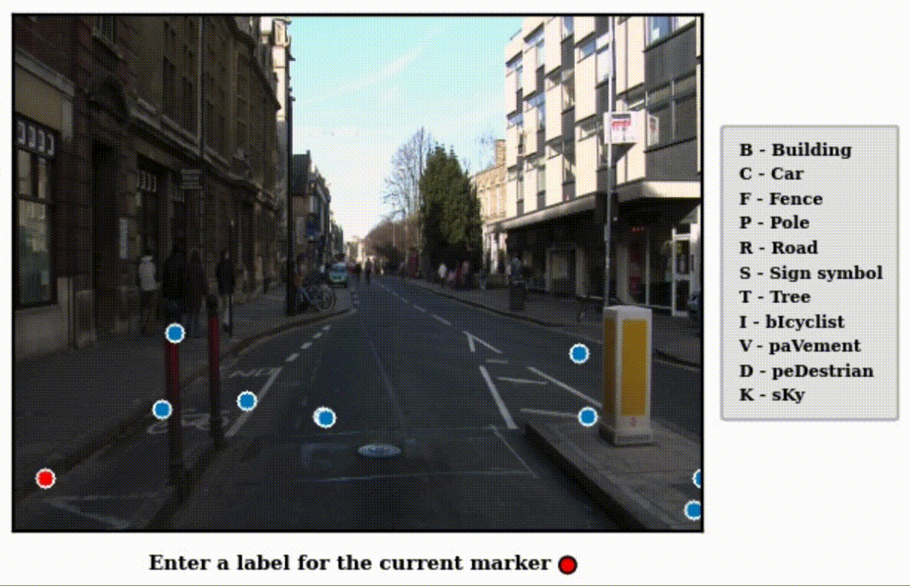

# PixelPick
This is an official implementation of the paper "All you need are a few pixels: semantic segmentation with PixelPick."

<p align="center">
  </img>
</p>

[[Project page]](https://noelshin.github.io/PixelPick/ "project_page")

### Table of contents
* [Abstract](#abstract)
* [Installation](#installation)
* [Benchmark results](#benchmark-results)
* [Models](#models) (to be updated)
* [PixelPick mouse-free annotation tool](#pixelpick-mouse-free-annotation-tool) (to be updated)
* [Citation](#citation) (to be updated)
* [Acknowledgements](#acknowledgements)

### Abstract
A central challenge for the task of semantic segmentation is the prohibitive cost of obtaining dense pixel-level annotations to supervise model training. In this work, we show that in order to achieve a good level of segmentation performance, all you need are a few well-chosen pixel labels. We make the following contributions: (i) We investigate the novel semantic segmentation setting in which labels are supplied only at sparse pixel locations, and show that deep neural networks can use a handful of such labels to good effect; (ii) We demonstrate how to exploit this phenomena within an active learning framework, termed PixelPick, to radically reduce labelling cost, and propose an efficient “mouse-free” annotation strategy to implement our approach; (iii) We conduct extensive experiments to study the influence of annotation diversity under a fixed budget, model pretraining, model capacity and the sampling mechanism for picking pixels in this low annotation regime; (iv) We provide comparisons to the existing state of the art in semantic segmentation with active learning, and demonstrate comparable performance with up to two orders of magnitude fewer annotations on the CamVid, Cityscapes and PASCAL VOC 2012 benchmarks; (v) Finally, we evaluate the efficiency of our annotation pipeline and its sensitivity to annotator error to demonstrate its practicality. Our code, models and annotation tool will be made publicly available.

### Installation
##### Prerequisites
Our code is based on `Python 3.8` and uses the following Python packages.
```
cv2, torch, torchvision, tqdm
```


##### Clone this repository
```shell
git clone https://github.com/NoelShin/PixelPick.git
cd PixelPick
```

##### Download dataset
Follow one of the links below and download a dataset you want to train/validate on. Then, set the `dir_dataset` variable in `args.py` to the directory path which contains the downloaded dataset.

[CamVid](https://www.kaggle.com/carlolepelaars/camvid "camvid") | [Cityscapes](https://www.cityscapes-dataset.com "cityscapes") | [PASCAL VOC 2012 segmentation](http://host.robots.ox.ac.uk/pascal/VOC/voc2012/#devkit)

##### Train and validate
By default, the current code validates the model every epoch while training. To train a MobileNetv2-based DeepLabv3+ network, follow the below lines. (The pretrained MobileNetv2 will be loaded automatically.)
```shell
cd scripts
sh pixelpick-dl-cv.sh
```
### Benchmark results

##### CamVid
model|backbone (encoder)| # labelled pixels per img (% annotation) | mean IoU (%)
:---|:---|:---:|:---:
PixelPick|MobileNetv2|20 (0.012)|50.8 ± 0.2
PixelPick|MobileNetv2|40 (0.023)|53.9 ± 0.7
PixelPick|MobileNetv2|60 (0.035)|55.3 ± 0.5
PixelPick|MobileNetv2|80 (0.046)|55.2 ± 0.7
PixelPick|MobileNetv2|100 (0.058)|55.9 ± 0.1
Fully-supervised|MobileNetv2|360x480 (100)|58.2 ± 0.6
PixelPick|ResNet50|20 (0.012)|59.7 ± 0.9
PixelPick|ResNet50|40 (0.023)|62.3 ± 0.5
PixelPick|ResNet50|60 (0.035)|64.0 ± 0.3
PixelPick|ResNet50|80 (0.046)|64.4 ± 0.6
PixelPick|ResNet50|100 (0.058)|65.1 ± 0.3
Fully-supervised|ResNet50|360x480 (100)|67.8 ± 0.3

##### Cityscapes
Note that to make training time manageable, we train on the quarter resolution (256x512) of the original Cityscapes images (1024x2048).

model|backbone (encoder)| # labelled pixels per img (% annotation) | mean IoU (%)
:---|:---|:---:|:---:
PixelPick|MobileNetv2|20 (0.015)|52.0 ± 0.6
PixelPick|MobileNetv2|40 (0.031)|54.7 ± 0.4
PixelPick|MobileNetv2|60 (0.046)|55.5 ± 0.6
PixelPick|MobileNetv2|80 (0.061)|56.1 ± 0.3
PixelPick|MobileNetv2|100 (0.076)|56.5 ± 0.3
Fully-supervised|MobileNetv2|256x512 (100)| TBU
PixelPick|ResNet50|20 (0.015)|56.1 ± 0.4
PixelPick|ResNet50|40 (0.031)|60.0 ± 0.3
PixelPick|ResNet50|60 (0.046)|61.6 ± 0.4
PixelPick|ResNet50|80 (0.061)|62.3 ± 0.4
PixelPick|ResNet50|100 (0.076)|62.8 ± 0.4
Fully-supervised|ResNet50|256x512 (100)|68.5 ± 0.3

##### PASCAL VOC 2012
model|backbone (encoder)| # labelled pixels per img (% annotation) | mean IoU (%)
:---|:---|:---:|:---:
PixelPick|MobileNetv2|10 (0.009)|51.7 ± 0.2
PixelPick|MobileNetv2|20 (0.017)|53.9 ± 0.8
PixelPick|MobileNetv2|30 (0.026)|56.7 ± 0.3
PixelPick|MobileNetv2|40 (0.034)|56.9 ± 0.7
PixelPick|MobileNetv2|50 (0.043)|57.2 ± 0.3
Fully-supervised|MobileNetv2|N/A (100)|57.9 ± 0.5
PixelPick|ResNet50|10 (0.009)|59.7 ± 0.8
PixelPick|ResNet50|20 (0.017)|65.6 ± 0.5
PixelPick|ResNet50|30 (0.026)|66.4 ± 0.2
PixelPick|ResNet50|40 (0.034)|67.2 ± 0.1
PixelPick|ResNet50|50 (0.043)|67.4 ± 0.5
Fully-supervised|ResNet50|N/A (100)|69.4 ± 0.3

### Models
Trained models will be uploaded soon.
[Link]("https://drive.google.com/file/d/1vtuSwLjFNjcfy4B2oiqkRWu0o-mbdqc4/view?usp=sharing" "link")

### PixelPick mouse-free annotation tool
<p align="center">
  </img>
</p>

Code for the annotation tool will be made available.
### Citation
To be updated.

### Acknowledgements
We borrowed code for the MobileNetv2-based DeepLabv3+ network from https://github.com/Shuai-Xie/DEAL.

If you have any questions, please contact us at {gyungin, weidi, samuel}@robots.ox.ac.uk.
